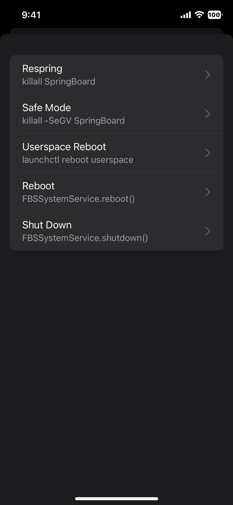
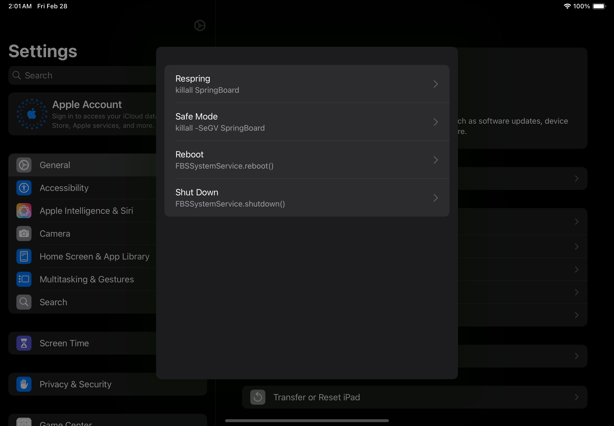

# PowerSettings
### Compatible with iOS 13-18.
A simple tweak to add power settings in the Settings app.

### Screenshots
 

### How to install
Head over to the [Releases](https://github.com/NightwindDev/PowerSettings/releases) section and download the correct `.deb` for your device.

### How to compile manually
Make sure you have [Theos](https://github.com/theos/theos) installed and configured.

Clone the repo and run the command you need:
```bash
# To build for rootful
make clean package FINALPACKAGE=1
# To build for rootless
make clean package THEOS_PACKAGE_SCHEME=rootless FINALPACKAGE=1
```

#### License
This project is licensed under [MIT](LICENSE).

###### Copyright (c) 2025 Nightwind